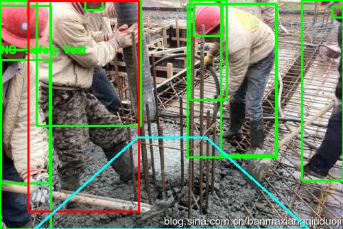
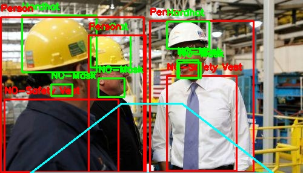

# Construction_Site_Safety
# AI-Powered Construction Safety Monitoring & Geofencing using YOLOv8

# Overview
This project focuses on enhancing workplace safety in construction and industrial environments using **Computer Vision**. By involving the **YOLOv8** architecture, the system detects workers, personal protective equipment (PPE), and machinery. **Additionally**, it implements a **Geofencing logic** to monitor restricted "Danger Zones" and provide real-time visual alerts.

# Key Features
**Multi-Class Detection:** Detects workers, helmets, safety vests, masks, and heavy machinery (Excavators, etc.).
**Dynamic Geofencing:** Defines a custom polygonal danger area (Trapezoid) within the frame.
**Real-time Safety Alerts:** Automatically changes worker bounding boxes from **Green** to **Red** when entering the danger zone.
**Industrial Application:** Designed to reduce accidents in high-risk environments.

# Visual Results
Here are some samples from the model's inference showing detection and safety zone monitoring:

| geofencing_alert_system | technical_inspection_monitoring |
|---|---|
|  |  |

| utility_work_monitoring | complex_site_monitoring |
|---|---|
|  |  |

# Technical Stack
* **Language:** Python
* **Core Model:** YOLOv8 (Ultralytics)
* **Computer Vision:** OpenCV
* **Environment:** Developed using PyCharm

# Citations & Referencing
This project utilizes the following technologies and frameworks:
* **Ultralytics YOLOv8:** Jocher, G., Chaurasia, A., & Qiu, J. (2023). Ultralytics YOLOv8 (Version 8.0.0) [Software]. Available at [https://github.com/ultralytics/ultralytics](https://github.com/ultralytics/ultralytics)
* **Dataset:** Based on industrial safety datasets available on Roboflow link (https://universe.roboflow.com/roboflow-universe-projects/construction-site-safety).
* **Developer:** [Your Name], MSc Data Analytics Student at BSBI, Berlin.

# Project Structure
Construction-Safety-YOLOv8/
requirements
scripts           # Training and Inference Python scripts
weights           # Pre-trained model (best.pt)
results           # Sample output images
README.md         # Project documentation
